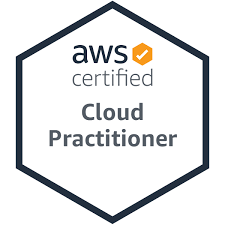
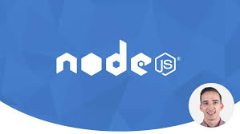

# SD&E Learning & Development Pathway

This is a modern web development learning & development pathway, which acts as a blueprint to help you acquire relevant skills set to tackle modern business challenges

This guide also layouts our expectations across grades in terms of:

- :bookmark: Courses which you should complete at your grade
- :blue_book: Certifications which you should obtain at your grade
- :computer: Our expectation in your capability to operate in a software development team, and
- :necktie: Our expectation in your capability to operate in a business environment

For each training course, this guide covers:

- :muscle: Motivation
- :white_check_mark: Skills you would acquire
- :clock1: Time required, and
- :pushpin: Tips to get the most out of the course

# Grades

- [Analyst](#Analyst)
- [Consultant](#Consultant)
- [Senior Consultant](#Senior Consultant)

## Analyst

Courses

### [Full-stack Web Development Bootcamp](https://www.udemy.com/course/the-complete-web-development-bootcamp/)

Enjoyment: :heart_eyes: :heart_eyes: :heart_eyes: :heart_eyes: :heart_eyes:

#### Motivation

Full-stack web development skills are alwasy in high demand. This course acts as a baseline bootcamp training, especially for those who come from a non-technical background, to ensure you possess the right skills in order to be operational, and productive in a software development team

#### Skills

Upon completion of this course, you would acquire the following skills:

- :art: Front-end web development with HTML5, CSS, Javascript, React, UX/UI degisn
- :1234: Back-end server-side programming with Node.JS
- :triangular_ruler: Developers tools such as Git version control

#### Time Required

- Two months of part-time effort assuming one hour of input on weekdays, and at least two hours of input on weekends

#### Tips

- Do follow Angela's exercises throughout the courses
- Start creating your technical learning notes. I personally recommend [Evernote](https://evernote.com/)

### [Java Masterclass](https://www.udemy.com/course/java-the-complete-java-developer-course/)

Enjoyment: :confused: :unamused: :expressionless: :expressionless:

#### Motivation

Java programming skills are always in high demand amongst large enterprise. Accoring to the 2020 Stack Overflow developer survey [here](https://insights.stackoverflow.com/survey/2020#technology-programming-scripting-and-markup-languages-all-respondents), Java is one of the top three most popular programming languages

#### Skills

Upon completion of this course, you would acquire the following skills:

- :loop: Programming in Java syntax - variables, flow control, operator, loop
- :computer: Object oriented programming in java

#### Time Required

- Six weeks of part-time effort assuming one hour of input on weekdays, and at least two hours of input on weekends

#### Tips

- Complete the first fourteen hours of the course as they provide the most revelent content to help you be productive in Java :key:
- You may find Tim's teaching style repetitive :unamused: I suggest a note taking approach for this course instead following along everything
- Once you understand the Java syntax, put your skills in practice by reaching at least Kyu 6 on [Codewars](https://www.codewars.com/)
- I recommend to also complete training in Java Spring to enable you to create web applications in Java

Certifications

### [AWS Certified Cloud Practitioner](https://www.udemy.com/course/aws-certified-cloud-practitioner-practice-exams-c/)

Enjoyment: :thumbsup: :thumbsup: :thumbsup: :thumbsup:

#### Motivation

The world :earth_americas: runs on cloud :cloud: By becoming an AWS Certified Cloud Practitioner it makes you relevant in a client coversation, and increaes your chance of landing a technical client engagement role

#### Prepration and Registration

Please follow the Alliance AWS 101 course on how to prepare, and register for the AWS Certified Cloud Practitioner certification

#### Tips

- I recommend to complete the Udemy AWS CCP prepreation questions [here](https://www.udemy.com/course/aws-certified-cloud-practitioner-practice-exams-c/). If you can score over 90% across the question sets, you are good to go
- I also recommend to study for the AWS Certified Solutions Architect – Associate certification, then take the AWS CCP examination followed by the AWS CSAA examination as the AWS CSAA content overlaps AWS CCP

## Consultant

At Consultant grade, you are expected to be able to operate and be productive, in **at least one front-end library/framework**, and **at least one back-end framework**

In addition, you should be able to operate and be productive, in **at least one platform engineering tool**

Courses

### [Node.JS](https://www.udemy.com/course/the-complete-nodejs-developer-course-2/)

Enjoyment: :thumbsup: :thumbsup: :thumbsup: :thumbsup: :thumbsup:

#### Motivation

Node.JS is one of the commonly used server-side programming tools according to the 2020 Stack Overflow developer survey [here](https://insights.stackoverflow.com/survey/2020#technology-other-frameworks-libraries-and-tools-all-respondents3). It is also commonly used to write AWS serverless Lambda functions

#### Skills

Upon completion of this course, you would acquire the following skills:

- :white_check_mark: Modern ES6 Javascript syntax
- :1234: Server-side programming in Node.JS
- :muscle: Unit testing in Node.JS

#### Time Required

- Two months of part-time effort assuming one hour of input on weekdays, and at least two hours of input on weekends

#### Tips

- Do follow Andrew's exercises throughout the courses
- Start creating your technical learning notes. I personally recommend [Evernote](https://evernote.com/)
- Put your skills in practice by contributing to the MERN stack open source project [here](https://github.com/deloitte-uk-systems-engineering/mern-ld-approval-app)

### [React](https://www.udemy.com/course/react-2nd-edition/)

Enjoyment: :thumbsup: :thumbsup: :thumbsup: :thumbsup: :thumbsup:

#### Motivation

React is one of the commonly used front-end web development libraries according to the 2020 Stack Overflow developer survey [here](https://insights.stackoverflow.com/survey/2020#technology-web-frameworks-all-respondents2). React skills is in high demand

#### Skills

Upon completion of this course, you would acquire the following skills:

- :key: Key principals of the React library. How to think in React components
- :muscle: Redux as a state management tool

#### Time Required

- Two months of part-time effort assuming one hour of input on weekdays, and at least two hours of input on weekends

#### Tips

- Do follow Andrew's exercises throughout the courses. You may fast-forward content on styling as it is not the key objective of the course
- Start creating your technical learning notes. I personally recommend [Evernote](https://evernote.com/)
- Put your skills in practice by contributing to the MERN stack open source project [here](https://github.com/deloitte-uk-systems-engineering/mern-ld-approval-app)

Certifications

Coming soon

## Senior Consultant

Courses

Coming soon

Certifications

Coming soon

## Contributing

Pull requests are welcome. For major changes, please open an issue first to discuss what you would like to change.

## License

[MIT](https://choosealicense.com/licenses/mit/)
